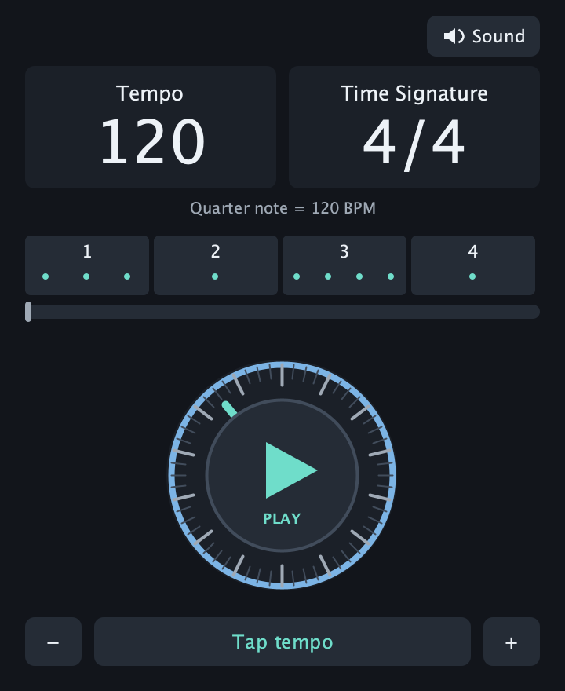
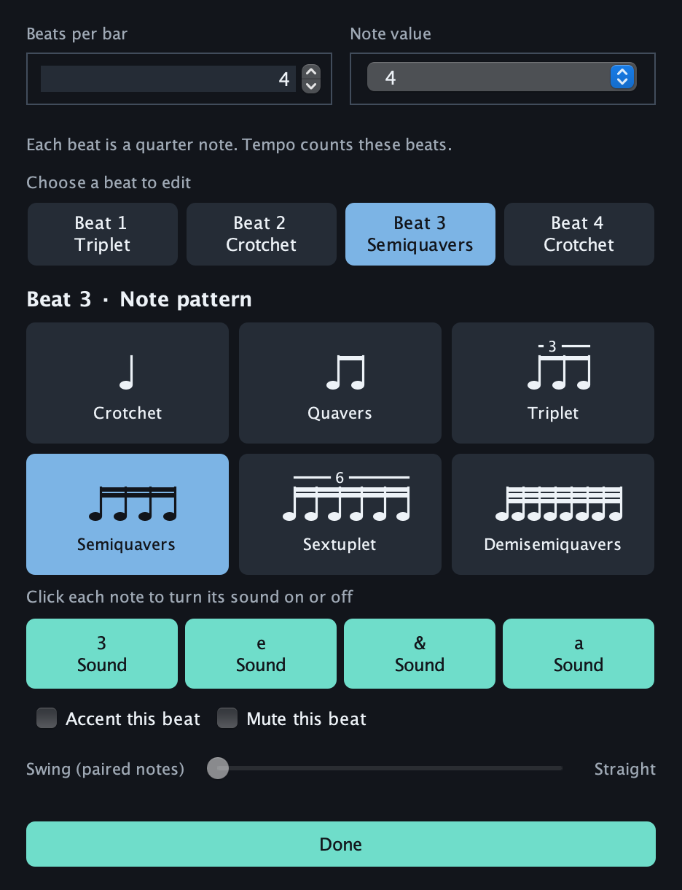

# PulseForge

A compact macOS metronome built with Java 21 and Spring. The app includes its own Java runtime.



## Use it

- **Tempo:** scroll or drag the outer wheel, use − / +, tap the tempo, or click the BPM to type a value.
- **Play / Pause:** click the center of the wheel. Pause holds the current beat position.
- **Time Signature:** click the displayed fraction to set 1–12 beats per bar and a note value of 1, 2, 4, 8, 16 or 32.
- **Each beat:** inside Time Signature, select a numbered beat, choose its note pattern, then toggle individual sounds into rests. Accents and whole-beat muting are also available.
- **Sound:** the top-right control opens output-device selection, volume, click sounds and GarageBand WAV/AIFF import.

The BPM counts the time-signature note. At 120 BPM in 4/16, each sixteenth-note beat lasts half a second. The note value is shown beneath the tempo and time signature.

For the example **triplet / crotchet / semiquavers / crotchet** in 4/4:

1. Open Time Signature and choose 4 beats with note value 4.
2. Select Beat 1 → Triplet.
3. Leave Beats 2 and 4 as Crotchet.
4. Select Beat 3 → Semiquavers. The four sound buttons read **3 e & a**.



Patterns divide one selected beat into 1, 2, 3, 4, 6 or 8 equal parts. Note names and notation adapt to the time-signature denominator. Swing applies to paired subdivisions. Beat-pattern edits and tempo changes take effect at the next beat boundary. Settings survive relaunches; older global-rhythm settings migrate to each beat.

Keyboard: Space plays/pauses from the wheel, T taps tempo, and the arrow keys adjust BPM. Escape closes the editors.

## Build and open

Requires macOS, JDK 21 including jpackage, and Maven:

```sh
./package-macos.sh
```

Double-click `dist/PulseForge.app`. The packaged app includes Java and does not require Maven to run. The build targets the Mac architecture used to package it. It is locally signed, not Apple-notarized.

For development:

```sh
mvn clean test
mvn package
java -jar target/pulseforge.jar
```

Optional native checks (isolated from saved user settings):

```sh
java -cp target/test-classes:target/classes app.pulseforge.ui.UiVerification build/ui-check
java -cp target/test-classes:target/classes app.pulseforge.audio.AudioVerification
```

The audio-device check runs at zero volume.

## Timing

The audio worker streams 48 kHz PCM and places each event on a continuous sample timeline. Fractional beat positions carry forward; each onset is rounded only when placed in the audio stream. Per-beat triplets, rests and other divisions share the same beat boundaries.

The moving bar reads the device's consumed-frame counter. Pause/resume uses that same position. Audio-device close/open operations are serialized so rapid transport changes cannot start competing streams. Sample decoding happens outside the render loop.

Tests cover mixed rhythms, rests, all supported denominators, pause position, swing, tempo changes, preference migration and an hour of simulated timing with at most approximately half a sample of placement error. This tests the generated timeline, not hardware-clock accuracy or round-trip latency. System load, output hardware and Bluetooth can still affect audible latency or cause dropouts.

## GarageBand audio

Use Sound → Import GarageBand audio to choose a PCM WAV/AIFF recording, including files within a GarageBand project's Media folder. The importer examines up to the first 45 seconds and extracts a short transient. Original recordings are not modified or included in this repository; the app remembers the local path.
