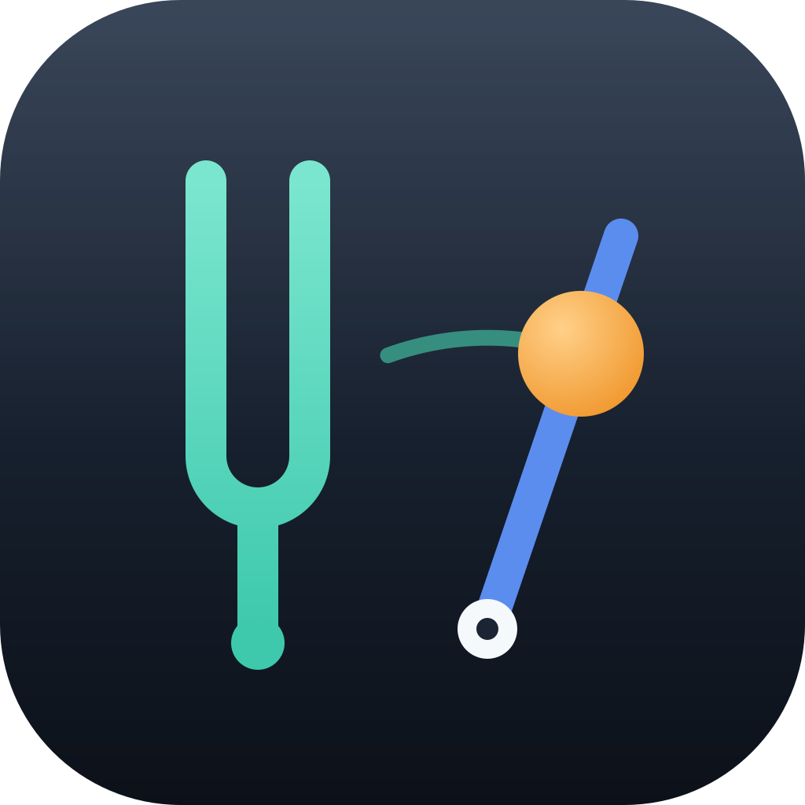
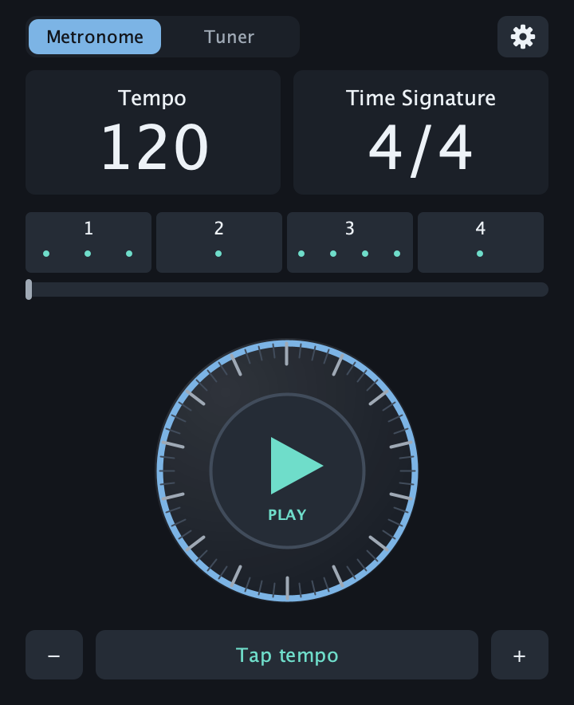
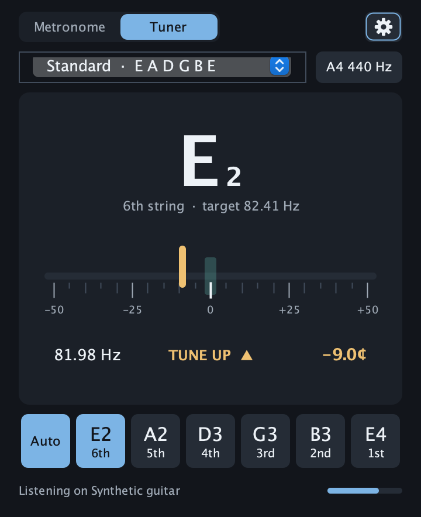
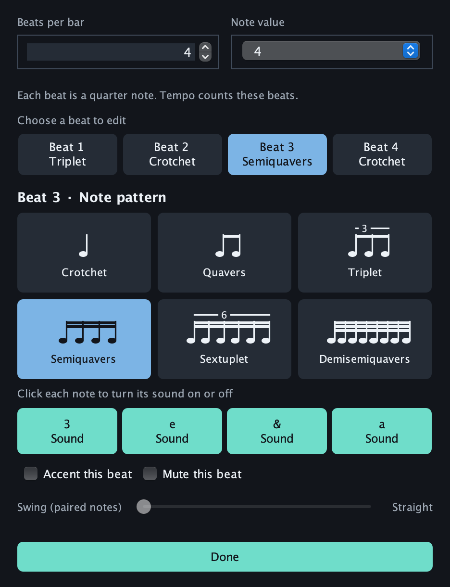

# T&T Pro

**Tone & Tempo Pro** is a compact macOS metronome and guitar tuner built with Java 21 and Spring. The app includes its own Java runtime.

<br clear="left">

<p>


</p>

## Use it

The switch in the top-left corner chooses **Metronome** or **Tuner** (also ⌘1 and ⌘2). The gear in the top-right corner opens **Settings**.

### Metronome

- **Tempo:** scroll or drag the knob (it turns with the tempo), use − / +, tap the tempo, or click the BPM to type a value. Tempo uses whole numbers from 20–300 BPM, in 1 BPM steps.
- **Play / Pause:** click the center of the wheel. Pause holds the current beat position.
- **Time Signature:** click the displayed fraction to set 1–12 beats per bar and a note value of 1, 2, 4, 8, 16 or 32.
- **Each beat:** inside Time Signature, select a numbered beat, choose its note pattern, then toggle individual sounds into rests. Accents and whole-beat muting are also available.

The BPM counts the time-signature note. At 120 BPM in 4/16, each sixteenth-note beat lasts half a second.

For the example **triplet / crotchet / semiquavers / crotchet** in 4/4:

1. Open Time Signature and choose 4 beats with note value 4.
2. Select Beat 1 → Triplet.
3. Leave Beats 2 and 4 as Crotchet.
4. Select Beat 3 → Semiquavers. The four sound buttons read **3 e & a**.



Patterns divide one selected beat into 1, 2, 3, 4, 6 or 8 equal parts. Note names and notation adapt to the time-signature denominator. Swing applies to paired subdivisions. Beat-pattern edits and tempo changes take effect at the next beat boundary. Settings survive relaunches, carry over from the app's earlier name (PulseForge), and older global-rhythm settings migrate to each beat.

### Tuner

Switch to **Tuner** and play one open string. The metronome pauses, the microphone opens, and the display shows:

- the string it hears, as a note name and string number (6th string is the low E);
- a ±50 cent scale with a needle, the measured frequency to 0.01 Hz and the offset to 0.1 cent;
- **Tune up ▲**, **Tune down ▼** or **In tune ✓** (within ±2 cents).

Strings that have held in tune for a moment get a ✓ so you can work through all six. **Auto** picks the nearest string in the chosen tuning; click a string button to tune only that string (click it again, press Space or click Auto to go back). ← / → move the manual selection.

- **Tuning:** the list at the top offers Standard, Drop D, Double drop D, Half step down, Whole step down, Drop C, DADGAD, Open D, Open E, Open G, Open A and 7-string standard / drop A. **Custom tuning…** sets each string's note individually (A1–A4).
- **Reference pitch:** click **A4 440 Hz** to calibrate between 400 and 480 Hz in 0.5 Hz steps.
- **Input:** Settings → Input device chooses the microphone or audio interface. Interfaces with several inputs are captured whole, and the tuner follows whichever input carries signal, so a guitar on input 2 of a Scarlett Solo is found without configuration; **Input channel** pins one input instead. The microphone is open only while the tuner is showing.

macOS asks for microphone permission the first time the tuner opens. If the level bar stays empty, check System Settings → Privacy & Security → Microphone.

### Settings

The gear opens output-device selection, volume, the metronome sound and the tuner's input device and channel.

Sounds: **Studio click**, **Wood block**, **Digital**, **Soft tick**, **Drum kit** (kick on accented beats, snare on the other beats, closed hi-hat on subdivisions), **Kick drum**, **Snare**, **Hi-hat** (open on accents, closed elsewhere), **Rimshot**, **Cowbell** and **Clave**. Choosing a sound plays it once; the ▶ button repeats the audition. Every sound is generated at launch and peaks at full scale. At 100% the volume slider reaches 0 dBFS, and a soft saturator lets overlapping drum hits compress instead of clipping.

Keyboard: Space plays/pauses from the wheel, T taps tempo, and the arrow keys adjust BPM. In the tuner, Space toggles Auto and the arrow keys choose a string. Escape closes the editors.

## Build and open

Requires macOS, JDK 21 including jpackage, and Maven:

```sh
./package-macos.sh
```

Double-click `T&T Pro.app` in `dist`. The packaged app includes Java and does not require Maven to run. The build targets the Mac architecture used to package it. It is locally signed, not Apple-notarized, and its Info.plist explains the microphone request.

For development:

```sh
mvn clean test
mvn package
java -jar target/tt-pro.jar
```

Optional native checks (isolated from saved user settings; the UI check feeds the tuner a synthetic string instead of the microphone):

```sh
java -cp target/test-classes:target/classes app.tonetempo.ui.UiVerification build/ui-check
java -cp target/test-classes:target/classes app.tonetempo.audio.AudioVerification
```

The audio-device check runs at zero volume.

## Timing

The audio worker streams 48 kHz PCM and places each event on a continuous sample timeline. Fractional beat positions carry forward; each onset is rounded only when placed in the audio stream. Per-beat triplets, rests and other divisions share the same beat boundaries.

The moving bar reads the device's consumed-frame counter. Pause/resume uses that same position. Audio-device close/open operations are serialized so rapid transport changes cannot start competing streams. Sample decoding happens outside the render loop.

Tests cover mixed rhythms, rests, all supported denominators, pause position, swing, tempo changes, preference migration and an hour of simulated timing with at most approximately half a sample of placement error. This tests the generated timeline, not hardware-clock accuracy or round-trip latency. System load, output hardware and Bluetooth can still affect audible latency or cause dropouts.

## Pitch detection

The tuner captures mono audio at 48 kHz (falling back to the device's rate) and analyzes an 85 ms window every 21 ms. Detection has two stages:

1. **Which note:** McLeod's normalized square difference function, computed through an FFT autocorrelation, with the first strong key maximum chosen as the period. Picking the earliest strong candidate avoids octave errors on strings whose fundamental is weak through a laptop microphone.
2. **How far from pitch:** the fundamental is isolated with a resonant band-pass and its period is measured across many cycles with sub-sample interpolation. A stiff string's upper partials ring slightly sharp; measuring the fundamental alone keeps them from pulling the reading. Filters settle over earlier windows so their transients never fall inside the samples being measured.

The display shows the median of readings from the last 300 ms, requires a clarity of 0.8 before trusting a reading, and switches strings only after three consecutive agreeing readings. Tests synthesize plucked strings with stiffness, decay, weak fundamentals and noise at 48 and 44.1 kHz; open-string readings stay within 0.5 cent of the true fundamental and weak-fundamental tones within 1 cent. Real accuracy also depends on the instrument, room noise and the microphone.
